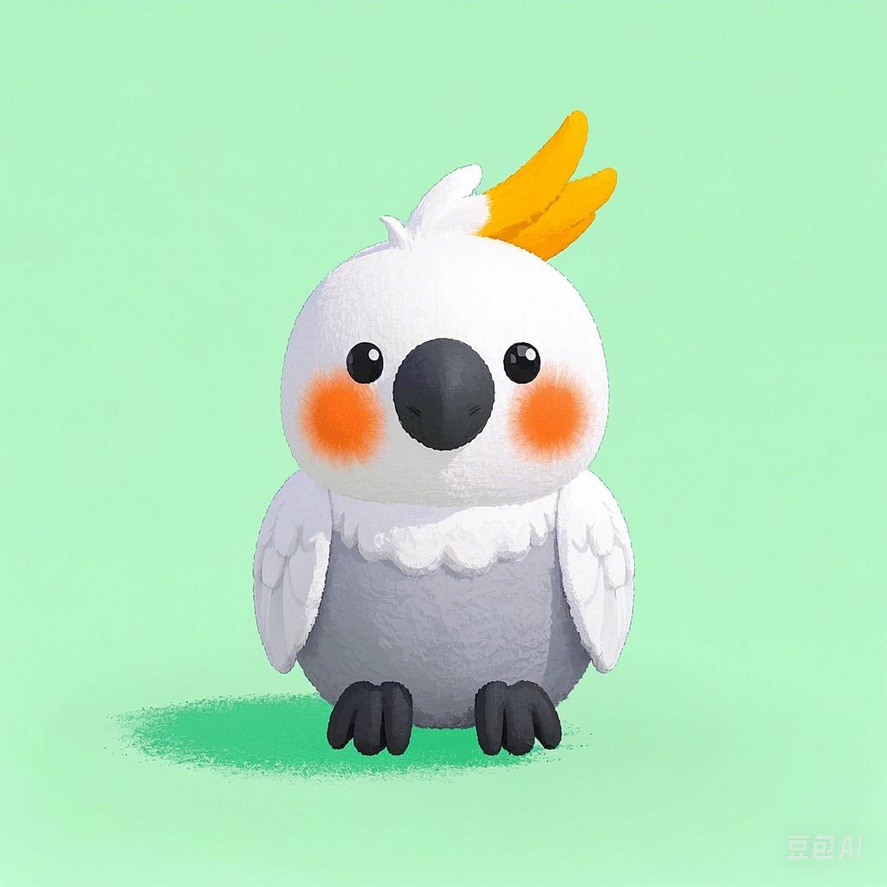

  

        🦜 <a href="https://github.com/wjinfeng/Cockatoo">Cockatoo 🦜</a>&nbsp
 

A simple framework to build an interesting LLM based chat companion.

## Optional Mode
This project provid three type of mode:

|Mode|Description|bots|player|
|---|---|---|---|
|**Single Interactive Mode**|A bot chatting with a player.|1|1|
|**Multi Interactive Mode**|Multiple bots chatting with one player.|2+|1|
|**Visiting Mode**|Only multiple bots chatting with each other.|2+|0|

